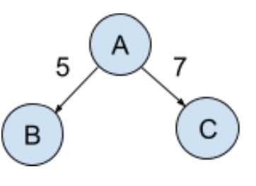

# Workflow Runner with Timed Node Traversal 

## About

This is a workflow runner that accepts the specification of a workflow in the form of a DAG represented in JSON where letters are assigned to the vertices and numbers are assigned to the edges. One node needs to be designated as the start vertex.

As the runner goes through the graph it prints the letter of each vertex it visits. Next, for each edge going out of a vertex it waits the specific number of seconds before traveling to the connected vertex.

**Note**: The runner processes edges in parallel so that it starts the “timer” for each edge going out of a vertex at the same time after printing the vertex letter. For example, consider the graph where A is the start vertex:



The runner should start by immediately printing A, then after 5 seconds print B, and then 2 seconds later print C. This graph, represented as JSON, would look something like:

```json
{
  "A": {"start": true, "edges": {"B": 5, "C": 7}},
  "B": {"edges": {}},
  "C": {"edges": {}}
}
```

## Running

### The "workflow engine"

This was tested on an OS X system running Python 3.10.2. To get a sense of how to run it, you can get the help by running `python main.py -h` at the command line. It will print something like this: 

```shell
workflow runner

positional arguments:
  workflow_spec         workflow specification path represented in JSON

options:
  -h, --help            show this help message and exit
  --with-timestamps, --no-with-timestamps
                        with_timestamps will print timestamps that the node
                        was visited (default: False)
```

If you have a workflow specification defined in "my_workflow.json" you could process the workflow with:

```shell
python main.py my_workflow.json
```

### The tests

The tests can be run with `python -m unittest discover`.


## Developing

This was developed using all standard Python libraries. There is a `dev-requirements.txt` that contains the Python package "black", but it's actually not necessary for development. It's a code formatter that is run before code is committed.

This was developed using the TDD methodology. It was started with `tests:RunnerTest.test_simple_json_file_runs_correctly` before any other code was written. The idea was to make it as black box as possible. That being said, I decided to take a bit of a shortcut and add a `--with-timestamp` optional argument to the script to make it easier to validate correct functionality during "end to end" testing.

A note on code documentation. My personal preference is to avoid it whenever possible. I've found that it's often out of date. It's far better to name variables, functions, etc. descriptively and refactor hard-to-understand code into smaller functions with clear names.

I'm not a huge fan of object-oriented programming, and avoid it where reasonable. I just find it easier to test and reason about when there's no strangely mutating state that I need to keep track of. For passing around data, I used named tuples here, but I also really like using Data Classes.

I've type-hinted most of the code here, though I've probably missed a couple of spots. It's super helpful for PyCharm's validator. I didn't run mypy on the code.